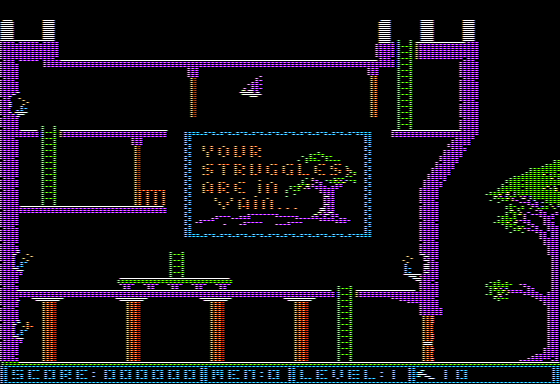

# Conan

It was one of the first Apple 2 games to use a 1-bit [stencil buffer](https://en.wikipedia.org/wiki/Stencil_buffer) for foreground/background objects.

* 

I uploaded [this](](https://i.imgur.com/5ZtUmBh.png)) to imgur years ago.

# Death Screen

Dying on level 1 produces this `Your struggles are in vain...`

* 

# Easter Eggs

* Introduction -- >!Wait for the music to stop playing to see the knight riding!<

* Level >!1!< -- >!If you DON'T kil lthe bat and jump off the top of the building and there is a secret ladder in the tree that gives an extra life!<

* Level >!3!< -- >!Jump and hit the bird with your head for an extra life!<

* Level >!7!< -- >!There is a secret super jump move in the bottom right!<

* End Screen -- >!secret initials!<

# ProDOS

qkumba did a [1-sided file conversion.](http://pferrie.epizy.com/misc/lowlevel16.htm?i=1)

> With that problem solved, we can compress the data to the point that it fits on a single side of a floppy disk. Imagine what other levels the authors could have included with a whole other side of the disk...
