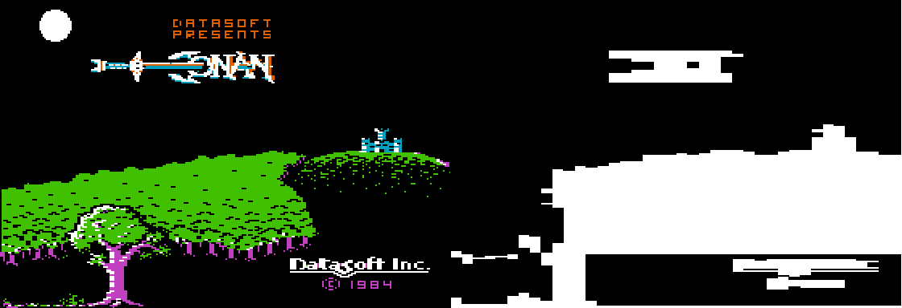
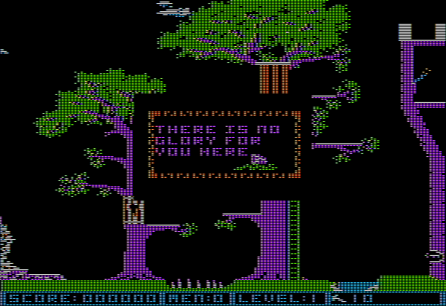
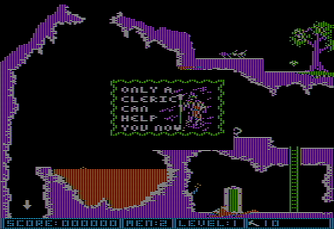

# Conan: Halls of Volta

It was one of the first Apple 2 games to use a 1-bit [stencil buffer](https://en.wikipedia.org/wiki/Stencil_buffer) for foreground/background objects.

* 

I uploaded [this](](https://i.imgur.com/5ZtUmBh.png)) to imgur years ago.

# Death Screen

There are 9 levels in Conan:

* Level 0 is the outside castle
* Level 8 is the end won screen
* Levels 1 - 7 are playable

Each of the 7 playable levels have 4 unique death messages (!):

* 
* 
* 
* 

* 
* 
* 
* 

* 
* 
* 
* 

* 
* 
* 
* 

* 
* 
* 
* 

* 
* 
* 
* 

* 
* 
* 
* 

The [Conand - Guide and Walkthrough](https://gamefaqs.gamespot.com/appleii/577826-conan/faqs/7804) has an incomplete and incorrect list.

Here are all the correct descriptions:

* 1a  Back to Cimmeria barbarian!!
* 1b  Bats in your belfry (moon)
* 1c  Your Struggles are in Vain
* 1d  Your odyssey has ended before it had begun (torch)
* 2a  A watery barrier (river)
* 2b  Quest terminated
* 2c  There is no glory for you here (flower)
* 2d  You withdraw battered and torn (tree)
* 3a  Death at thy feet, life from above... (ants)
* 3b  You beat a heated retreat... (lava)
* 3c  Only a cleric can help you now (cleric)
* 3d  You Succumb to Lassitude (cavern outline)
* 4a  Thus, the story ended...
* 4b  Conan's Bane! (mushroom mob on ledge)
* 4c  The End (crossed swords)
* 4d  You sink slowly into a peaceful bliss (vase)
* 5a  You shuffle off defeated for now (quarter moon)
* 5b  To be continued... (tombstone)
* 5c  Adveture's End... (candle) [NOTE: mispelt Adventure]
* 5d  The glow from the pyre lights the room (bonfire)
* 6a  The eyes have it (3 eyes)
* 6b  Thy fate is sealed (scroll)
* 6c  A Shocking End (lightning)
* 6d  Crom awaits (sword & goblet)
* 7a  Volta's minions take you to the Loph-ka slave pits (horse)
* 7b  Volta is victorious
* 7c  You retire more dead than alive (island)
* 7d  The Crimson Orb recedes on your horizon (sun)

Animated death icons:

* 

# Easter Eggs

* Introduction -- >!Wait for the music to stop playing to see the knight riding!<

* Level >!1!< -- >!If you DON'T kil lthe bat and jump off the top of the building and there is a secret ladder in the tree that gives an extra life!<

* Level >!3!< -- >!Jump and hit the bird with your head for an extra life!<

* Level >!7!< -- >!There is a secret super jump move in the bottom right!<

* End Screen -- >!secret initials!<

* Text Screen -- Pressing `Ctrl`-`Reset` will show the Datasoft logo on the text screen.

# ProDOS

qkumba did a [1-sided file conversion.](http://pferrie.epizy.com/misc/lowlevel16.htm?i=1)

He closed with this cheeky statement:

> With that problem solved, we can compress the data to the point that it fits on a single side of a floppy disk. Imagine what other levels the authors could have included with a whole other side of the disk...
