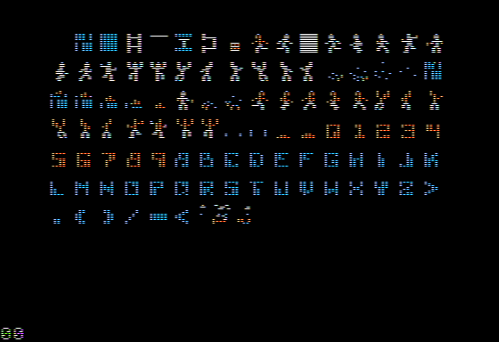

# Lode Runner

To debug the iris VFX  screen effect.

```
BPC *
BPM 62B0
BPM 62B3
G
```

Lode Runner

* clears both HGR pages
* draws the level on HGR page 2
* draws the scoreboard footer on HGR page 1
* iris VFX copies bits from page 2 to page 1

# Sprites

Sprites are located at $AD00 .. $B5FF. Each tile has dimenions 10x11 px.

The format is 7-bit `uint8_t [22][104]` because there are 2 bytes per scanline. Alternative Left, then Right.

  | Scanline | Left Half      | Right Half     |
  |---------:|:---------------|:---------------|
  |        0 | $AD00 .. $AD67 | $AD68 .. $ADCF |
  |        1 | $ADD0 .. $AE37 | $AE38 .. $AEBF |
  |        2 | $AEA0 .. $AF07 | $AF08 .. $AF6F |
  |        3 | $AF70 .. $AFD7 | $AFD8 .. $B03F |
  |        4 | $B040 .. $B0A7 | $B0A8 .. $B10F |
  |        5 | $B110 .. $B177 | $B178 .. $B1DF |
  |        6 | $B1E0 .. $B247 | $B248 .. $B2AF |
  |        7 | $B2B0 .. $B317 | $B318 .. $B37F |
  |        8 | $B380 .. $B3E7 | $B3E8 .. $B44F |
  |        9 | $B450 .. $B4B7 | $B4B8 .. $B51F |
  |       10 | $B520 .. $B587 | $B588 .. $B5EF |

The high bit is set at drawing time.



Run the program `viewtiles.bin` on the included disk image [viewtiles.po](viewtiles.po).

# Sprite Viewer

See [viewtiles.s](viewtiles.s).
