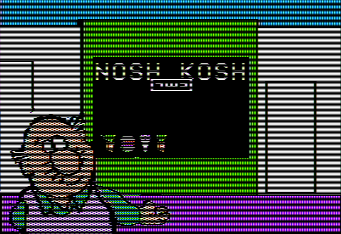
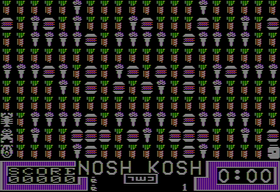

# Nosh Kosh



Nosh Kosh was originally written in Applesoft (!)
and compiled with Microsoft's [TASC](https://devblogs.microsoft.com/oldnewthing/20220419-00/?p=106496) (The AppleSoft Compiler) (!!).

It resides from $4000 .. $4FAC.

There is a Microsoft copyright signature at $4F93:4FAC (Mem) in the file `RUNTIME`

```
ASC 4F93:4FAC
MA1 4F93 // MS TASC copyright signature
```

The file `N-R2.OBJ` resides at $4FAD and calls the RUNTIME.INIT ($4000) first thing.
```
4FAD: JSR $4000
```

See the last file name loaded by DOS 3.3:
```
MA2 AA75 // DOS last filename
```

# Levels



There are 5 levels.

Each level is 20x10 tiles (200 bytes).

The disk includes the original Applesoft BASIC program to create them.

```BASIC
"BSAVE SCRN1,A36256,L200"
```

* `SCREAN1` generates level `SCRN1`
* `SCREAN2` generates level `SCRN2`
* `SCREAN3` generates level `SCRN3`
* `SCREAN4` generates level `SCRN4`
* `SCREAN5` generates level `SCRN5`

# UI

The UI is mirrored on the text screen!

# AppleWin Debugger Reverse Engineering

1. `F7`
2. `cd ..`
3. `run noshkosh.txt`

See [noshkosh.txt](noshkosh.txt)
