# Run-for-It

# Intro

Back in the 80's I played a **bad** game called [Run-for-It](https://www.mobygames.com/game/run-for-it). 

* 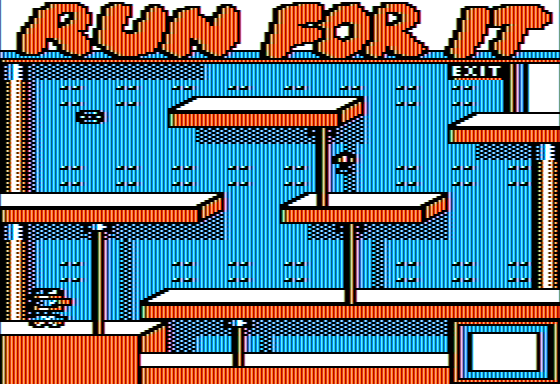


# Why?

If it was so bad why write all this up? I was curious about:

* How many rooms there were?
* What are all the font glyphs?
* What is the main game loop?
* What is the tile set it used?

Back in Dec. 2021 / Jan. 2022 I spent a few days reverse engineering it.


# Reverse Engineering

The goal is to turn this raw machine code ...

* 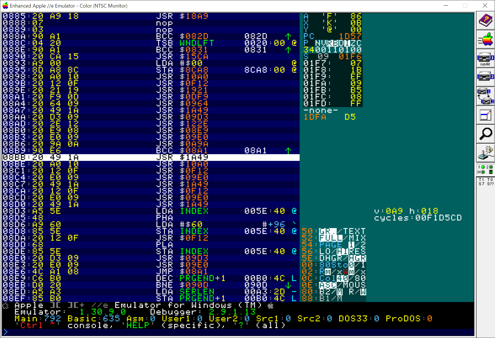

... into this nice assembly language disassembly:

* 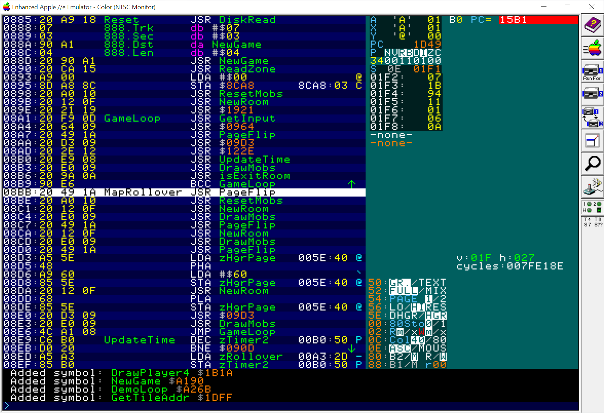

Look at the AppleWin [Run for It debugger script](run_for_it.txt) for details.


# Map

After 40 years I can finally answer the question:

* There are 6*12 = 72 rooms

Here is the 1:1 world map for the 6 zones:

* 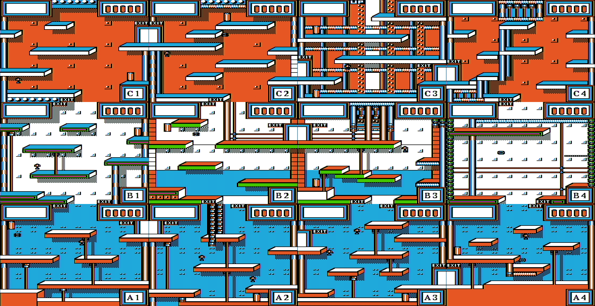
* 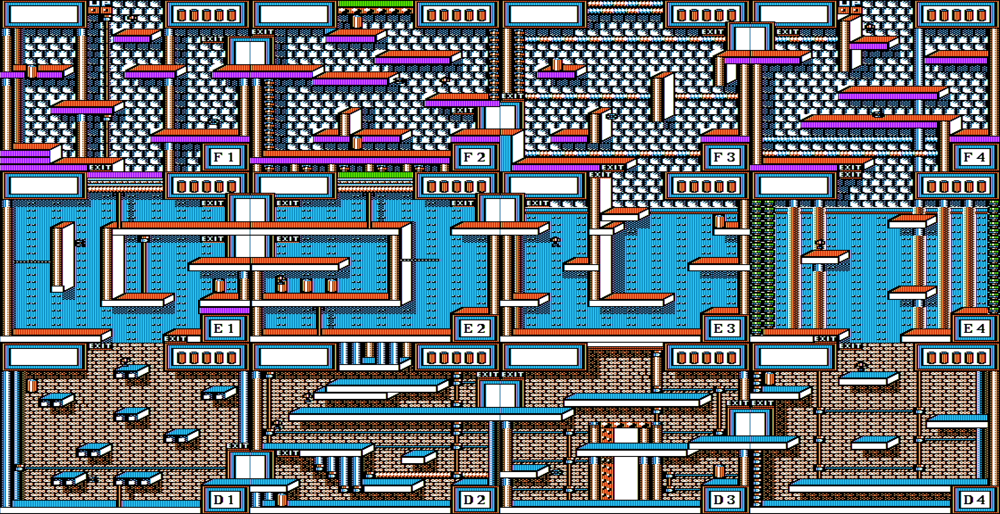
* 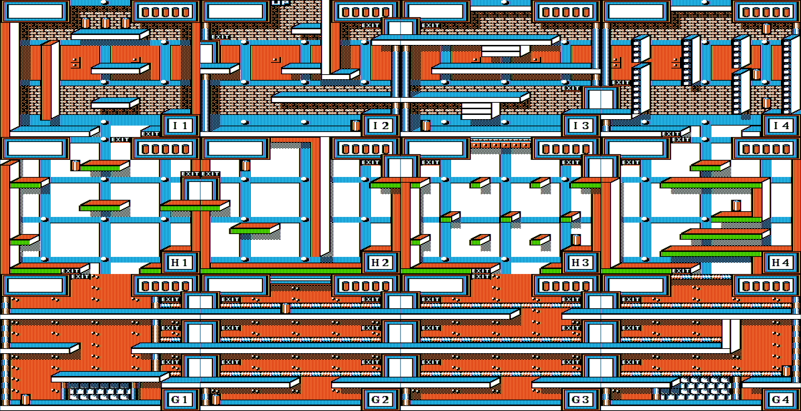
* 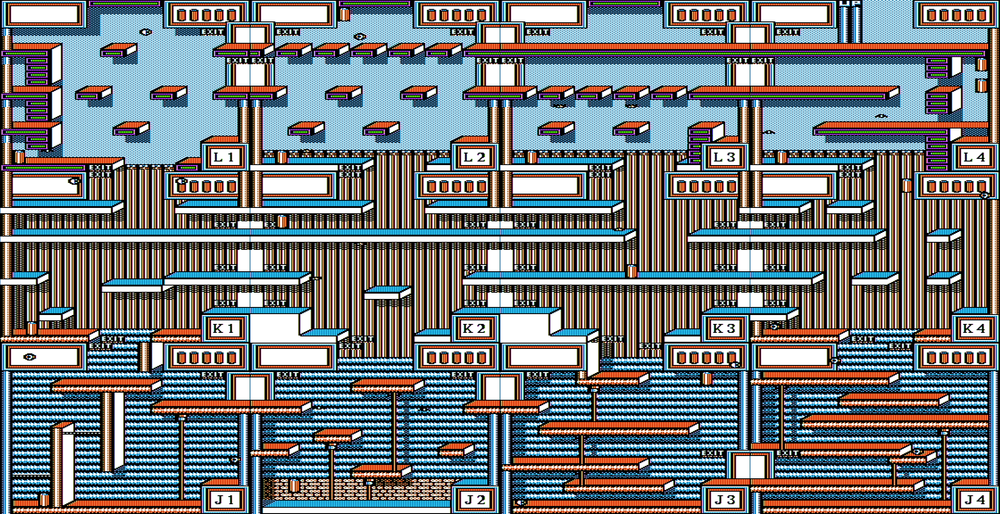
* 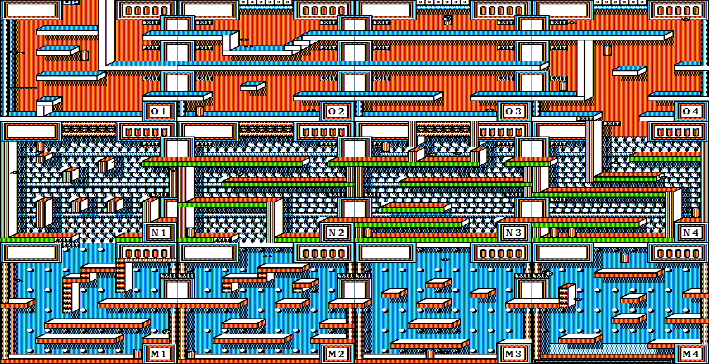
* 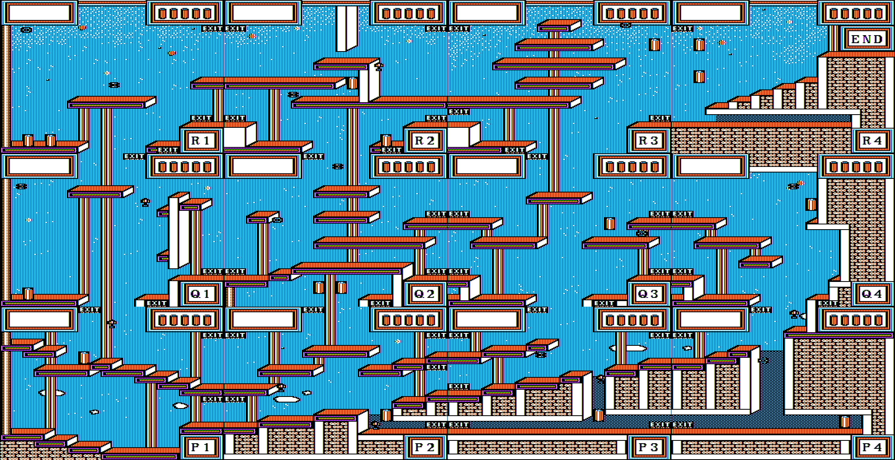

The world is broken up into Zones and Rooms;

* There are 6 zones.
* Each zone has 12 rooms in a 4x3 layout.

The first zone has rooms A1, A2, A3, A4, B1, B2, B3, B4, C1, C2, C3, and C4.


# Tile Set

Here zone has their own respective tile set.  I only dumped the tiles for the first zone, glyphs 00..7F:

* 
* 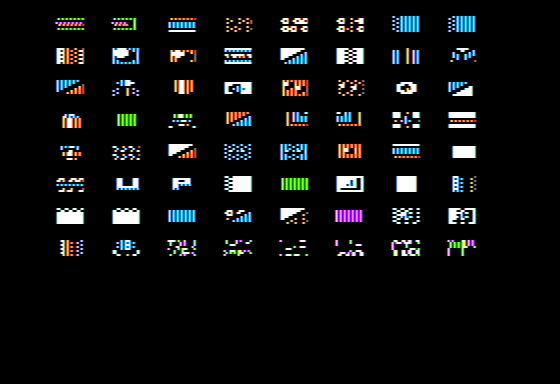

See the assembly source [view_tiles.s](view_tiles.s).


# Font

I was curious about the font so I dumped it:

* 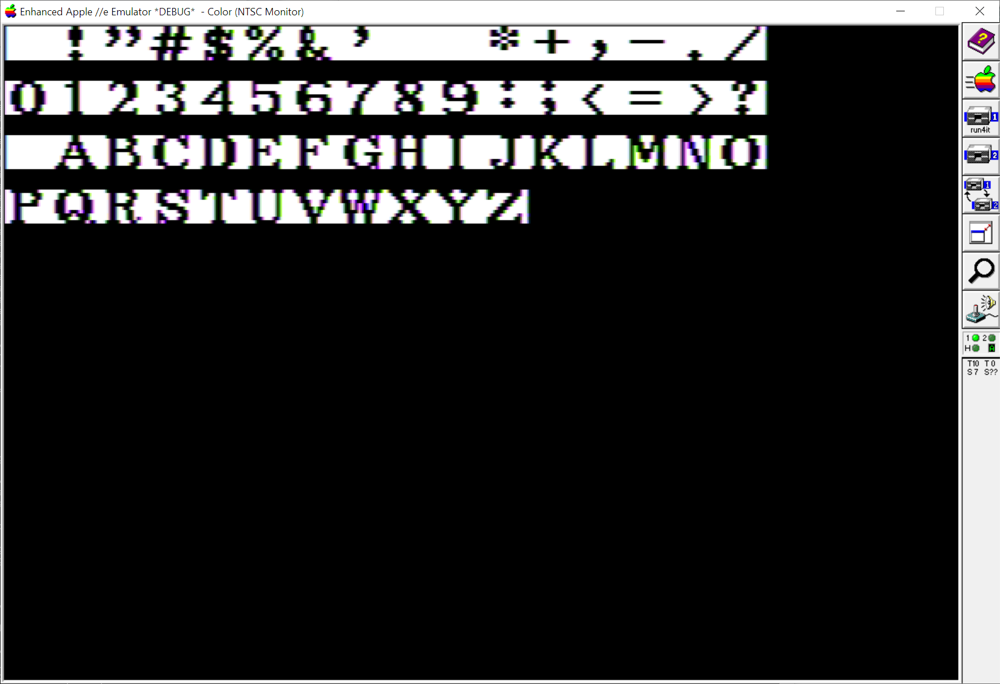

See the assembly source [view_font.s](view_font.s)


# Cheats

As long as you have energy you can't die.

* Unlimited energy:

```
// Invulnerability
// v3
//     1261:90 // Original: BCC $128C
       1261:80 // Cheat   : BRA $128C ; Never collide with enemies
```

* Infinite time:

There is also a running clock that we can stop:

```
// Infinite Time
//     08E9:C6 B0  // Original: DEC $B0
       08E9:A5 B0  // Cheat:    LDA $B0 ; Infinite Time

       00AE:50     // Reset time back to full 5 bars
       00B0:50     // 
```

See the assembly file [run_for_it_cheats.txt](run_for_it_cheats.txt)

Last updated: Mon, Oct. 31, 2022.
